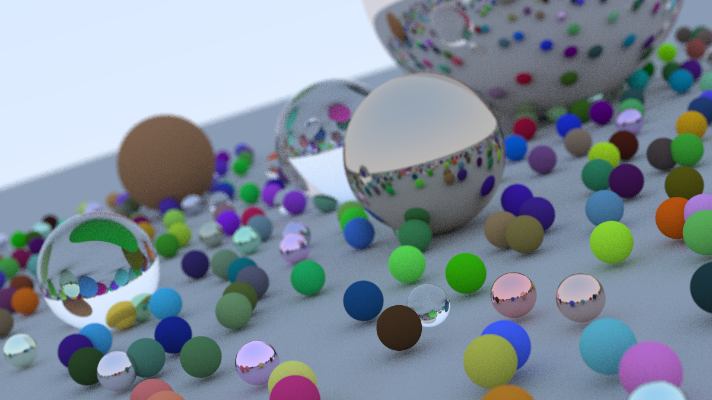

# Ray Tracing In One Weekend

Rust implementation of a basic ray tracer as described in [_Ray Tracing in One Weekend_](https://raytracing.github.io/books/RayTracingInOneWeekend.html) as a learning exercise for both the Rust language and the topic.

To run the program and create a sample image `img.jpg` use the following command.

```bash
$ cargo run --release > img.jpg
```

Example image:


